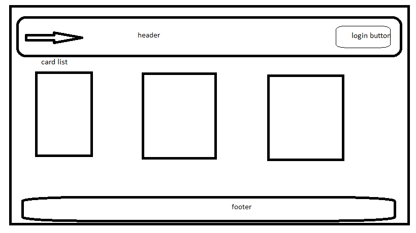

# Team-Agreement

## Readers Team
**team members**
- Adham Alomari
- Samah Abujwaied
- Osama Momani
- Qusai Qeisi
- Saja Alraja
- Maysaa hourani

1. What are the key strengths of each person on the team?
> - Adham Alomari "time managment, good comunication "
> - Samah Abujwaied "CSS master, frontend , hard worker , smart worker " 
> - Osama Momani "JS master , creative thinking , problem solveing "
> - Qusai Qeisi "time managment, CSS ,problem solveing "
> - Saja Alraja "creative thinking,hard worker ,good comunication"
> - Maysaa hourani " happy place , good comunication"

2. How can you best utilize these strengths in the execution of your project?
> each skill of these  will help us to make the project more eficient and orginaized .

3. In which professional competencies do you each want to develop greater strength?
> In Full stack  devlopment 
4. Knowing that every person in your team needs to understand all aspects of the project, how do you plan to approach the day-to-day work?
> determine the idea of our project
> planing for excuting our idea 
> devideing the tasks .
> Start to build functionality and thinking to achieve our goal
 

## Conflict Plan .

1. What will be your group’s process to resolve conflict, when it arises?
> to wait until we solve the conflict . by telling the team about it .
2. What will your team do if one person is taking over the project and not letting the other members contribute?
> detect the problem ,comunicat togather and trying to solve the issue .
3. How will you approach each other and the challenges of the project knowing that it is impossible for all members to be at the exact same place in understanding and skill level?
> help and explaine the work that we did or we will do in semple way .
5. How will you raise concerns to members who are not adequately contributing?
> explain everything for him to make it easy to understand .
6. How and when will you escalate the conflict if your resolution attempts are unsuccessful?
> if we could not make it solve we will use the plan B .

## Communication Plan
> Slack ,ZOOM, Discord .

## Work Plan
> we will use Trello.

## Git Process 
> after we select the idea .

# Prepare for Projects 

## Summary of idea.

> The domain of idea its going to allow the clients have oppartinite to read books that he/she prefer and can find the book in our site also have to save it to read later or in favourite book section.

## What is the minimum required for you to present on your demo day?
> finell project will done 

## 2 top ideas
> * books 
> * New site 

## work place 
[readers trello](https://trello.com/readers13)

## github organization 
[
Readers-Team](https://github.com/Readers-Team)

## Wiarfram
